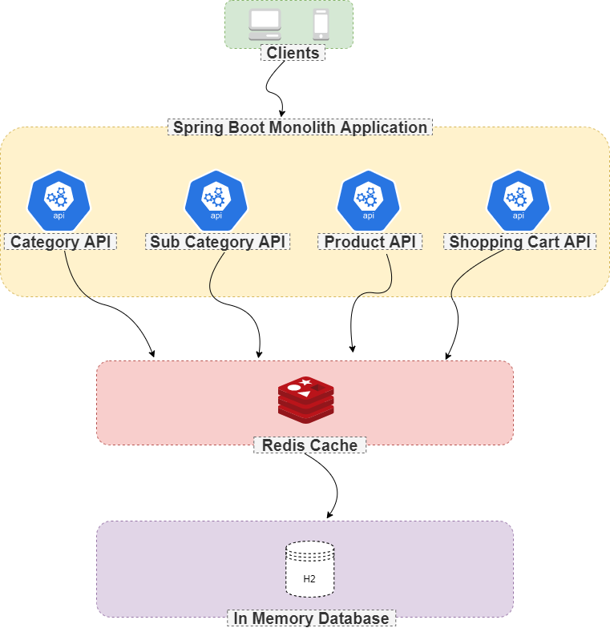

# Stock Management :moneybag:

[](https://app.codacy.com/gh/oguzhancevik/stock-management?utm_source=github.com&utm_medium=referral&utm_content=oguzhancevik/stock-management&utm_campaign=Badge_Grade_Settings)

``` 
  The application consists of 3 parts. Category, Subcategory and Product. 
* Each category has a name and one or more subcategories.
* Each subcategory has a name, category, and one or more products.
* Each product has a name, price, stock quantity and a subcategory.
```

### Tech Stack & Patterns :rocket:
* Java 11
* Spring Boot
* Maven
* Hibernate
* Redis
* Docker
* Swagger
* H2
* Junit
* Factory Pattern
* CQRS Pattern

### Build & Run :dart:

###### Docker

``` docker-compose up -d --build ```

###### Backend

``` mvn clean install ```

``` mvn --projects io.github.oguzhancevik:stock-management spring-boot:run ```

### Design :art:


### APIs :memo:
| API                                              | Method | Description                         |
|--------------------------------------------------|--------|-------------------------------------|
| /api/categories                                  | GET    | Returns categories                  |
| /api/categories/{categoryId}                     | GET    | Returns a specific category         |
| /api/categories                                  | POST   | Creates a new category              |
| /api/categories/{categoryId}                     | PUT    | Updates a specific category         |
| /api/categories/{categoryId}                     | DELETE | Deletes a specific category         |
| /api/subcategories                               | GET    | Returns sub categories              |
| /api/subcategories/{subCategoryId}               | GET    | Returns a specific sub category     |
| /api/subcategories                               | POST   | Creates a new sub category          |
| /api/subcategories/{subCategoryId}               | PUT    | Updates a specific sub category     |
| /api/subcategories/{subCategoryId}               | DELETE | Deletes a specific sub category     |
| /api/products                                    | GET    | Returns products                    |
| /api/products/{productId}                        | GET    | Returns a specific product          |
| /api/products/search/category/{categoryId}       | GET    | Returns products by category id     |
| /api/products/search/subcategory/{subCategoryId} | GET    | Returns products by sub category id |
| /api/products/search/name/{productName}          | GET    | Returns products by product name    |
| /api/products/search/price/?min=200&max=500      | GET    | Returns products by price interval  |


### Postman Collection :pushpin:
[Click Here](static/stock-management.postman_collection.json)

### Swagger UI :gift:
http://localhost:8080/swagger-ui/

### License :key:
Distributed under the MIT License. See [LICENSE](LICENSE) for more information.
